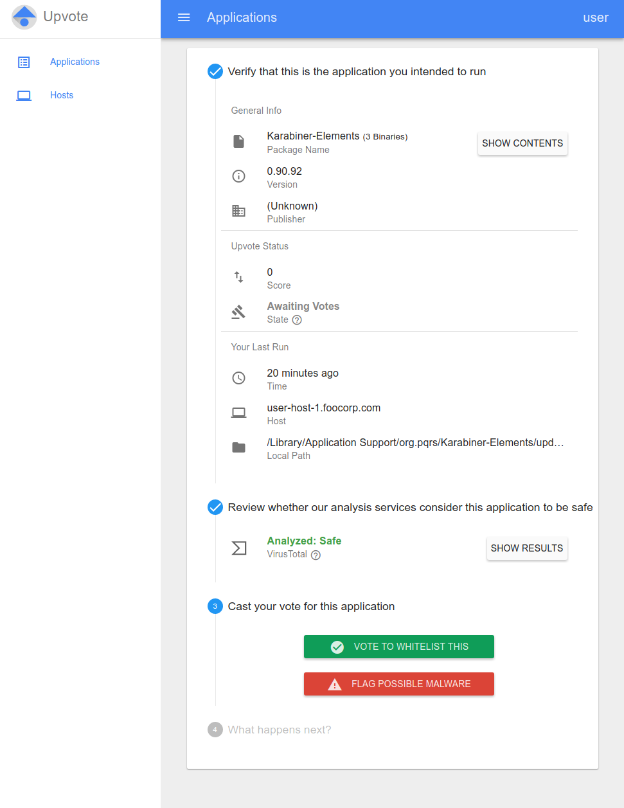

**Note: upvote_py2 is being archived**

After thoughtful discussion, Upvote maintainers have decided to stop updating the Upvote codebase in Github, now named upvote_py2.
The decision came down to our moving away from the App Engine Python 2 runtime. We have developed substantial new Python 3 code that would take more effort to port back to this environment than we can spend while focused on developing new features internally for Google.

To those still actively using Upvote: we are hopeful that someone else will take on the work of porting and maintaining a Python 3 version of Upvote to share with the community. If that happens we would be interested in contributing code and ideas from our internal version of Upvote. Development of Santa is not affected by this.

Social allowlisting works at Google. We hope it will continue to work for other organizations that need to scale allowlist management. We look forward to sharing ideas and improvements despite not having the resources at this time to support an external codebase.

Thanks, 

Ben, on behalf of the Upvote team

<!-- mdformat off(GitHub header) -->
Upvote

======
<!-- mdformat on -->

  

Upvote is a multi-platform binary whitelisting solution. It provides both a sync
server and management interface for binary enforcement clients. Upvote currently
supports [Santa](https://github.com/google/santa) on macOS and
[Bit9](https://www.carbonblack.com/products/cb-protection/) (now known as Carbon
Black Protection) on Windows.

## Features

-   **First-party sync server for Santa**
    -   Written in coordination with Santa's development team
-   **User-oriented Policy Creation**
    -   Apply policies to users instead of hosts
    -   No migration necessary when users get new hosts
-   **BigQuery streaming**
    -   Fast, easy, and scalable relational access to Santa and Bit9 execution
        data
-   **Bundled Voting for .app bundles on macOS**
    -   Easily create policy for an entire bundle at once
-   **VirusTotal Integration**
    -   View VirusTotal results directly in the detail page

## Screenshot

<kbd>  </kbd>

## Setup

See the [docs page](docs/setup.md) for full instructions.

## Docs

-   **Background**
    -   [What is Application Whitelisting?](docs/basics.md)
    -   [Security Discussion](docs/security.md)
    -   [General Architecture](docs/architecture.md)
-   **Setup**
    -   [Setup](docs/setup.md)
    -   [How to Set Policy](docs/voting.md)
    -   [Users in Upvote](docs/users.md)
-   **Santa**
    -   [Santa Syncing](docs/santa_sync.md)
    -   [Santa Bundle Voting](docs/bundles.md)
-   **Bit9**
    -   [Bit9 Syncing](docs/bit9_sync.md)

## Contributing

We are current working hard to get Upvote ready for external contributions.
However, at this time, we do not have the necessary approvals to do so.

In the meantime, please feel free to file GitHub issues or post in our Google
Group, [upvote-discuss](https://groups.google.com/forum/#!forum/upvote-discuss),
with any comments, bugs, or feature requests.

## Contributors

Core Contributors: [Chief](https://github.com/chief8192),
[Matthew](https://github.com/msuozzo)

Special thanks to [Danny](https://github.com/danielloera),
[Haru](https://github.com/haruphoenix), [Maxim](https://github.com/maximermilov)

And to the Santa team: [Russell](https://github.com/russellhancox),
[Tom](https://github.com/tburgin), [Ed](https://github.com/eigerman),
[Phillip](https://github.com/nguyen-phillip)

## Disclaimer

This is not an official Google product.
